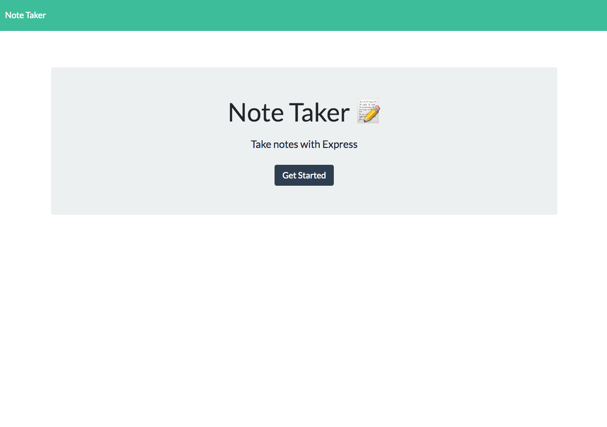

# Note Taker
* A simple application to take and store notes.  Notes persist and may be deleted.

## Description
* This is a front end application that interacts with the user to create, store and delete notes with a title and a body.  The front end communicates with the back end Express.js server to run GET, POST and DELETE API routes as well as handling the HTML routes.

## Links
* [Heroku Live Server Link](https://guarded-headland-65223.herokuapp.com/)
* [GitHub Repo Link](https://github.com/taylornyquist/note-taker)
* [Link to Video](https://drive.google.com/file/d/1X4iDYOq_6Gii7T_ZCzeEGn8lCjA6uAGn/view)




## Table of Contents

* [Usage](#usage)
* [Installation](#installation)
* [Run](#run)
* [Technology](#technology)
* [Questions](#questions)
* [Contribution](#contribution)

## Usage
Go to GitHub to clone the repo on your machine.

## Installation
To install necessary dependencies, run the following command:
```
npm init
```
```
npm install express
```
```
npm install uniqid
```

## Run
To run the application as local host, run:
```
npm start
```

## Technology
This application used the following technology:

* JavaScript
* Node.js
* Express.js
* Uniqid
* CSS
* HTML

## Questions
If you have any questions about the repo, open an issue or contact me directly at tnyquist@gmail.com.  You can find more of my work at [taylornyquist](https://github.com/taylornyquist).


## Contribution
* Taylor Nyquist
